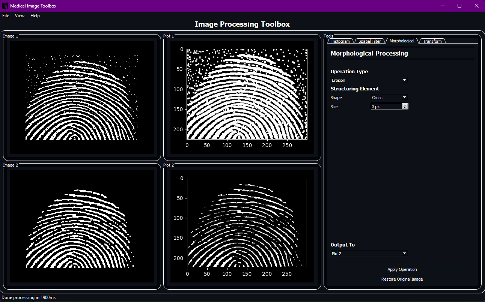
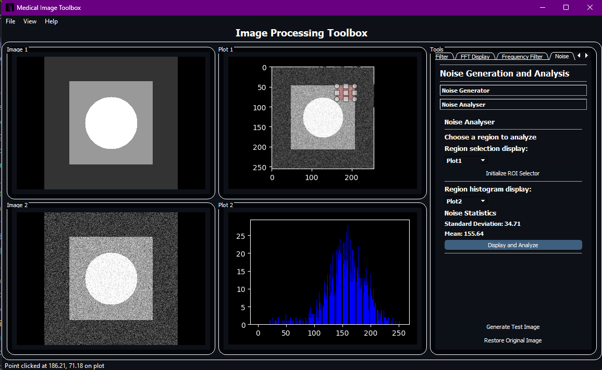

# Image Processing Toolbox

A simple image processing toolbox written from scratch in Python using PyQt5 and numpy.

## Preview

### Quick Runthrough


### Detailed Feature Screenshots

| Metadata| Resizing | Rotation | Shearing |
| --- | --- | --- | --- |
|  |  |  |  |

|Histogram Equalization| Erosion & Dilation| Opening and Closing|
| --- | --- | --- |
|  |  |  |

| Box Blur | Median Blur | Highboost Filter |
| --- | --- | --- | 
|  |  |  |

|Low Pass Filter | High Pass Filter | Band Pass Filter | Band Reject Filter |
| --- | --- | --- | --- |
|  |  |  |  |

| Backprojection and Sinogram | Noise Generation | Noise Analysis ROI|
| --- | --- | --- |
|  |  |  |

## Features

### Opens Image files

| File Type | Supported | Notes |
| --- | --- | --- |
| DICOM | Yes | |
| JPG | Yes | |
| BMP | Yes | |
| PNG | Yes | |
| TIFF | Yes | Not fully|

### View Metadata

* Width and Height in pixels
* Image Size in bytes
* File Size in bytes
* Compression ratio
* Channel Depth
* Color Space (RGB, CMYK, etc)


### Affine Transformations

#### Interpolation Methods

* Nearest Neighbor
* Bilinear

#### Operations

* Resizing
  * Factors ranging from 0.01x to 16x
* Rotation
* Shearing

### Filters

| Spatial Domain | Frequency Domain |
| --- | --- |
| Box Blur | Low Pass Filter |
| Median Blur | High Pass Filter |
| Highboost Filter | Band Pass Filter |
| | Band Reject Filter |

### Image Enhancement

#### Histogram Equalization

* Display Histogram
* Equalize Histogram

#### Morphological Processing

| Operations | Structuring Elements |
| --- | --- |
| Erosion | Square |
| Dilation | Cross |
| Opening | Circle |
| Closing | |

## How to install

Just download the release from gh releases, unzip then run the executable.

## How to run dev environment

1. Clone the repo
2. Create a virtual environment in the src directory

    ```bash
    cd <this repo>/src
    python -m venv ./env
    ```

3. Activate the virtual environment

    ```bash
    Scripts\Activate.ps1 # for powershell
    ```

    ```bash
    Scripts\Activate.bat # for cmd
    ```

4. Install dependencies from requirements.txt

    ```bash
    pip install -r requirements.txt
    ```

5. Run the app

    ```bash
    python image_viewer.py 
    ```

## Architecture Block Diagram (OUTDATED)

